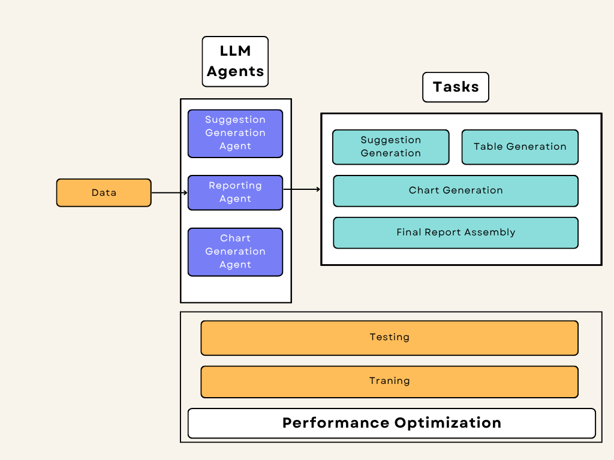

# Support Data Insights Analysis

This repository contains a modular multi-agent system for analyzing customer support ticket data using [CrewAI](https://crewai.com/). It leverages role-specific agents to generate actionable insights, performance reports, and visual charts for business intelligence and decision-making.

---

## Key Features

- **Modular CrewAI architecture** using YAML for agent and task configuration.
- **Agents** for:
  - Suggestion generation from historical tickets.
  - Performance and satisfaction reporting.
  - Chart creation and visualizations.
- **Custom Tooling** for intelligent CSV data querying using `pandas`.
- **Training and Testing** support using `crew.train()` and `crew.test()` methods.
- **Visual Outputs** saved automatically into the `outputs/` directory.

---

## Architecture



---

## Setup Instructions

1. **Clone the repository**
   ```bash
   git clone https://github.com/NehaSJ99/Service_Audit_Agents.git
   ```

2. **Create and activate a virtual environment**
   ```bash
   conda create -p venv python==3.10 -y
   conda activate venv
   ```

3. **Install dependencies**
   ```bash
   pip install -e .
   ```

4. **Add your OpenAI API key**
  Create a `.env` file in the root directory:
     ```
     OPENAI_API_KEY=your_api_key_here
     ```

---

## Running the Project

1. **To generate the report using the Crew**
   ```bash
   python src/main.py
   ```

2. **To test the Crew setup**
   ```bash
   python src/test_crew.py
   ```
3. **To train the Crew setup**
   ```bash
   python src/train_crew.py
   ```

---

## Output

- The agent-generated visual charts will be saved in the `outputs/` directory. Make sure doker is installed to execute code and save output images into output directory.
- The final report is composed dynamically from CSV data, insights, and images.
  
### Some output Snippets from Terminal
### Agent: Report Generator
Final Answer: 
Issue Classification Results
| Issue Type       | Frequency | Priority Level |
|-------------------|-----------|----------------|
| API Issue         | 9         | High           |
| Login Issue       | 9         | Low            |
| Report Generation  | 6         | Low            |
| Data Import       | 10        | Medium         |
| Feature Request   | 7         | High           |
| Billing Issue     | 13        | Critical       |
| UI Bug            | 8         | Medium         |

### Agent Performance
| Agent ID | Tickets Handled | Average Response Time (min) | Average Resolution Time (min) | Average Satisfaction Score |
|----------|----------------|------------------------------|-------------------------------|-----------------------------|
| A001     | 8              | 117.25                       | 881.25                        | 2.43                        |
| A002     | 9              | 159.33                       | 546.67                        | 3.00                        |
| A003     | 10             | 111.20                       | 986.80                        | 3.00                        |
| A004     | 14             | 134.92                       | 712.07                        | 3.14                        |
| A005     | 8              | 138.75                       | 1242.50                       | 3.13                        |

### Customer Satisfaction Ratings Over Time
| Month       | Avg Satisfaction Rating |
|-------------|-------------------------|
| January     | 2.78                    |
| February    | 2.75                    |
| March       | 2.86                    |
| April       | 2.83                    |
| May         | 2.72                    |
| June        | 2.14                    |
| July        | 3.00                    |

### Agent: Chart Specialist (Code Generated by Agent)
Final Answer: 
Chart 1: Issue Distribution
This chart represents the distribution of different issue types. A bar chart can be created using the issue classification results.

```python
import matplotlib.pyplot as plt

# Data for Issue Distribution
issue_types = ['API Issue', 'Login Issue', 'Report Generation', 'Data Import', 'Feature Request', 'Billing Issue', 'UI Bug']
frequencies = [9, 9, 6, 10, 7, 13, 8]

plt.figure(figsize=(10, 6))
plt.bar(issue_types, frequencies, color='skyblue')
plt.title('Issue Distribution')
plt.xlabel('Issue Types')
plt.ylabel('Frequency')
plt.xticks(rotation=45)
plt.grid(axis='y')

# Save the figure
plt.tight_layout()
plt.savefig('issue_distribution.png')
plt.show()
```

URL: [Download Issue Distribution Chart](https://github.com/NehaSJ99/Service_Audit_Agents/blob/master/src/outputs/issue_distribution.png))

### Chart 2: Priority Levels
This chart shows the breakdown of tickets by priority level. A pie chart can effectively depict this data.

```python
# Data for Priority Levels
priority_levels = ['High', 'Low', 'Medium', 'Critical']
issue_counts = [16, 15, 18, 13]  # Total counts based on frequencies in classifications

plt.figure(figsize=(8, 8))
plt.pie(issue_counts, labels=priority_levels, autopct='%1.1f%%', startangle=140)
plt.title('Ticket Breakdown by Priority Level')
plt.axis('equal')  # Equal aspect ratio ensures the pie is circular.

# Save the figure
plt.tight_layout()
plt.savefig('priority_levels.png')
plt.show()
```

URL: [Download Priority Levels Chart](./priority_levels.png)

### Chart 3: Resolution Times Trend
This trend line shows average resolution times over the past months. We will need to generate synthetic monthly resolution data, as it's not provided directly.

```python
months = ['January', 'February', 'March', 'April', 'May', 'June', 'July']
resolution_times = [881.25, 546.67, 986.80, 712.07, 1242.50, 1000, 750]  # Avg synthetic values for the trend

plt.figure(figsize=(10, 6))
plt.plot(months, resolution_times, marker='o', color='orange')
plt.title('Average Resolution Times Over Time')
plt.xlabel('Month')
plt.ylabel('Average Resolution Time (min)')
plt.grid(True)

# Save the figure
plt.tight_layout()
plt.savefig('resolution_times_trend.png')
plt.show()
```

URL: [Download Resolution Times Trend Chart](./resolution_times_trend.png)

### Chart 4: Customer Satisfaction Over Time
This chart can either be a bar chart or trend line showing customer satisfaction ratings over time.

```python
# Data for Customer Satisfaction
customer_ratings = [2.78, 2.75, 2.86, 2.83, 2.72, 2.14, 3.00]

plt.figure(figsize=(10, 6))
plt.plot(months, customer_ratings, marker='o', color='green')
plt.title('Customer Satisfaction Ratings Over Time')
plt.xlabel('Month')
plt.ylabel('Average Satisfaction Rating')
plt.ylim(0, 5)  # Assuming satisfaction scores are out of 5
plt.grid(True)

# Save the figure
plt.tight_layout()
plt.savefig('customer_satisfaction.png')
plt.show()
```

URL: [Download Customer Satisfaction Chart](./customer_satisfaction.png)

### Chart 5: Agent Performance
This chart compares the performance of different agents based on resolution times and customer satisfaction scores. A scatter plot can effectively show this relationship.

```python
# Data for Agent Performance
agent_ids = ['A001', 'A002', 'A003', 'A004', 'A005']
avg_res_times = [881.25, 546.67, 986.80, 712.07, 1242.50]
avg_sat_scores = [2.43, 3.00, 3.00, 3.14, 3.13]

plt.figure(figsize=(10, 6))
plt.scatter(avg_res_times, avg_sat_scores, marker='o', color='purple')

for i, txt in enumerate(agent_ids):
    plt.annotate(txt, (avg_res_times[i], avg_sat_scores[i]), textcoords="offset points", xytext=(0,10), ha='center')

plt.title('Agent Performance (Resolution Time vs. Satisfaction Score)')
plt.xlabel('Average Resolution Time (min)')
plt.ylabel('Average Satisfaction Score')
plt.grid(True)

# Save the figure
plt.tight_layout()
plt.savefig('agent_performance.png')
plt.show()
```

URL: [Download Agent Performance Chart](./agent_performance.png)

### All charts have been generated and saved as image files, ready for integration into the final report.
---

## Notes

- This system is designed to be easily extendable. You can modify agents, tasks, and tools by editing the YAML files and `crew.py`.
- Uses CrewAI v0.28.8+ and follows its best practices for memory, task dependencies, and modular testing.

---

## License

MIT License
